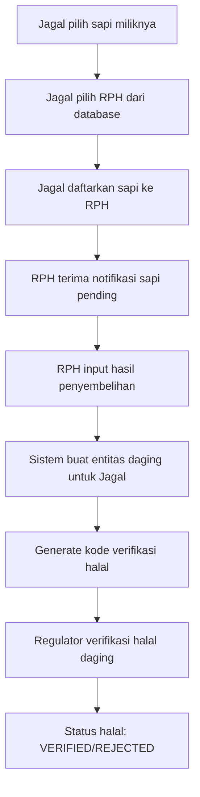

# Summary Implementation - Sistem Transaksi Penyembelihan

## 🎯 Overview

Telah berhasil diimplementasikan sistem transaksi penyembelihan sapi antara **Jagal**, **RPH**, dan **Regulator** dengan alur bisnis yang sesuai kebutuhan:

1. **Jagal** memilih sapi miliknya dan mendaftarkan ke RPH tertentu
2. **RPH** menerima daftar sapi dan memproses penyembelihan dengan input detail berat
3. **Regulator** melakukan verifikasi halal pada hasil penyembelihan

---

## ✅ Completed Features

### Backend Implementation

#### Database Schema Updates

- **Model TransaksiPenyembelihan**: Redesigned dengan alur Jagal → RPH
- **Model Daging**: Enhanced dengan detail paket (daging, jeroan, tulang) dan status halal
- **Model Jagal**: Relasi ke TransaksiPenyembelihan dan Daging
- **Model RPH**: Relasi ke TransaksiPenyembelihan dan Daging
- **Verification System**: Kode verifikasi halal unik untuk tracking

#### Controller Functions

```
✅ jagalDaftarkanSapi() - Jagal daftarkan sapi ke RPH
✅ getSapiJagal() - Jagal lihat sapi miliknya
✅ getDaftarRPH() - Jagal lihat daftar RPH
✅ getSapiPendingRPH() - RPH lihat sapi pending
✅ rphProsesPenyembelihan() - RPH input hasil penyembelihan
✅ regulatorVerifikasiHalal() - Regulator verifikasi halal
✅ getRiwayatTransaksiPenyembelihan() - Riwayat transaksi
✅ getStatistikPenyembelihan() - Statistik dashboard
✅ getDagingPendingVerifikasi() - Daging pending verifikasi
```

#### API Endpoints

```
✅ GET /api/transaksi-penyembelihan/jagal/sapi
✅ GET /api/transaksi-penyembelihan/jagal/rph
✅ POST /api/transaksi-penyembelihan/jagal/daftarkan
✅ GET /api/transaksi-penyembelihan/rph/sapi-pending
✅ POST /api/transaksi-penyembelihan/rph/proses-penyembelihan
✅ GET /api/transaksi-penyembelihan/regulator/daging-pending
✅ POST /api/transaksi-penyembelihan/regulator/verifikasi-halal
✅ GET /api/transaksi-penyembelihan/riwayat
✅ GET /api/transaksi-penyembelihan/statistik
```

#### Security & Validation

- **Authentication**: JWT-based dengan role validation
- **Authorization**: Role-based access (JAGAL, RPH, REGULATOR)
- **Data Validation**:
  - Validasi kepemilikan sapi oleh jagal
  - Validasi berat tidak melebihi berat sapi
  - Cek sapi tidak sudah disembelih
  - Validasi RPH yang terdaftar

#### IPFS Integration

- **Data Storage**: Setiap transaksi disimpan di IPFS
- **Traceability**: CID disimpan untuk audit trail
- **Actions**: PENDAFTARAN → PEMROSESAN → VERIFIKASI

---

## 📊 Business Flow



---

## 💾 Database Structure

### Transaksi Penyembelihan

```sql
- id: UUID (primary key)
- jagalId: FK ke Jagal (pendaftar)
- rphId: FK ke RPH (processor)
- sapiId: FK ke Sapi
- status: PENDING | PROCESSED
- tanggalPendaftaran: DateTime
- tanggalPemrosesan: DateTime
- beratDaging, beratJeroan, beratTulang: Float
- cid: String (IPFS hash)
```

### Daging (Hasil Penyembelihan)

```sql
- id: UUID (primary key)
- sapiId: FK ke Sapi (unique)
- jagalId: FK ke Jagal (owner)
- rphId: FK ke RPH (processor)
- beratDaging, beratJeroan, beratTulang: Float
- totalBerat: Float
- transaksiPenyembelihanId: FK (unique)
- statusHalal: PENDING | VERIFIED | REJECTED
- kodeVerifikasiHalal: String (unique)
```

---

## 🔧 Technical Details

### API Authentication

```javascript
Headers: {
  'Authorization': 'Bearer <JWT_TOKEN>',
  'Content-Type': 'application/json'
}
```

### Example API Calls

#### 1. Jagal Daftarkan Sapi

```bash
POST /api/transaksi-penyembelihan/jagal/daftarkan
{
  "sapiId": "sapi-uuid",
  "rphId": "rph-uuid"
}
```

#### 2. RPH Proses Penyembelihan

```bash
POST /api/transaksi-penyembelihan/rph/proses-penyembelihan
{
  "transaksiId": "transaksi-uuid",
  "beratDaging": 250.5,
  "beratJeroan": 45.2,
  "beratTulang": 80.3
}
```

#### 3. Regulator Verifikasi Halal

```bash
POST /api/transaksi-penyembelihan/regulator/verifikasi-halal
{
  "dagingId": "daging-uuid",
  "statusVerifikasi": "VERIFIED"
}
```

---

## 📁 Files Updated/Created

### Backend Files

```
✅ /prisma/schema.prisma - Updated schema
✅ /controllers/transaksiPenyembelihanController.js - New controller
✅ /routes/transaksiPenyembelihanRoutes.js - Updated routes
✅ /utils/authMiddleware.js - Authentication middleware
```

### Documentation Files

```
✅ /docs/TRANSAKSI_PENYEMBELIHAN_API_NEW.md - Complete API docs
✅ /docs/TRANSAKSI_PENYEMBELIHAN_CHECKLIST.md - Implementation checklist
✅ /docs/test-transaksi-penyembelihan.sh - API test script
```

---

## 🚀 Next Steps (Frontend Integration)

### 1. Jagal Interface Updates

```javascript
// Update JagalTransaksiPenyembelihan.jsx
- Form pilih sapi milik jagal (dari API)
- Dropdown RPH (dari API /jagal/rph)
- Submit pendaftaran (POST /jagal/daftarkan)
- View status pendaftaran
```

### 2. RPH Interface Updates

```javascript
// Update RphTransaksi.jsx
- List sapi pending (GET /rph/sapi-pending)
- Form input hasil penyembelihan:
  * beratDaging, beratJeroan, beratTulang
  * Validation total <= berat sapi
- Submit pemrosesan (POST /rph/proses-penyembelihan)
```

### 3. Regulator Interface (New)

```javascript
// Create RegulatorDashboard.jsx
- List daging pending (GET /regulator/daging-pending)
- Form verifikasi halal (approve/reject)
- Submit verifikasi (POST /regulator/verifikasi-halal)
```

---

## 🎯 Key Benefits

### 1. **Traceability**

- Setiap tahap tercatat dengan IPFS hash
- Kode verifikasi halal unik untuk tracking
- Audit trail lengkap dari sapi → daging

### 2. **Role-based Security**

- Setiap role hanya akses data yang relevan
- Jagal hanya lihat sapi miliknya
- RPH hanya lihat sapi yang didaftarkan ke RPH tersebut
- Regulator verify semua daging pending

### 3. **Data Integrity**

- Validasi berat hasil penyembelihan
- Cegah double processing sapi yang sama
- Relational constraints di database

### 4. **Business Compliance**

- Alur sesuai proses bisnis real
- Verifikasi halal oleh regulator
- Status tracking untuk audit

---

## ⚠️ Important Notes

1. **Database Migration**: Schema sudah diupdate, pastikan backup database
2. **Authentication**: Perlu pastikan JWT secret di environment variables
3. **IPFS**: Pastikan IPFS node running untuk data storage
4. **Testing**: Gunakan test script untuk validasi endpoint
5. **Frontend**: Perlu update frontend sesuai endpoint baru

---

## 🔍 Testing

Gunakan test script yang telah disediakan:

```bash
chmod +x docs/test-transaksi-penyembelihan.sh
./docs/test-transaksi-penyembelihan.sh
```

Update token dan ID sesuai data testing Anda.

---

**Status**: ✅ Backend Complete | ⏳ Frontend Pending | 📋 Ready for Integration
